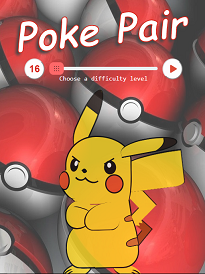
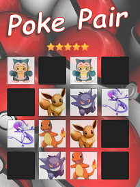

# POKE PAIR :performing_arts:
A simple, straightforward memory game designed to test the player's memory.

## GETTING STARTED :pencil:
To start playing:
  - Clone the repository 
    - Clone or download the repository 'Poke-Pair' by clicking on the Clone or Download button
    - Open the 'index.html' file and start playing!
    
    **or**

  - Visit the link: https://verma-anushka.github.io/Poke-Pair/.

    **or**
  
- You can also find **Poke Pair** and many more cool games at the link: https://verma-anushka.github.io/Gaming-Zone/.

## FEATURES :fire:
- Difficulty Levels :grey_exclamation:
- Rating :star:	
- Hint :heavy_exclamation_mark:

If you have more suggestions or you wish to add more features, just open a pull request :shipit:

## HOW TO PLAY? :clipboard:
- Choose a difficulty level
- Select two cards
  - If the pair doesn't match, the cards will be flipped back with the face down
  - Else, the revealed pair will be visible to you throughout
- Keep revealing the cards and working your memory to remember each unveiled card
- Match cards properly with less moves and in faster time

## TECHNOLOGIES USED :speech_balloon:
- **HTML5**: current major version of HTML that subsumes XHTML
- **CSS3**: latest evolution of the Cascading Style Sheets language 
- **VANILLA JS**: plain JavaScript without any additional libraries like jQuery

## Game Snapshots :camera:

